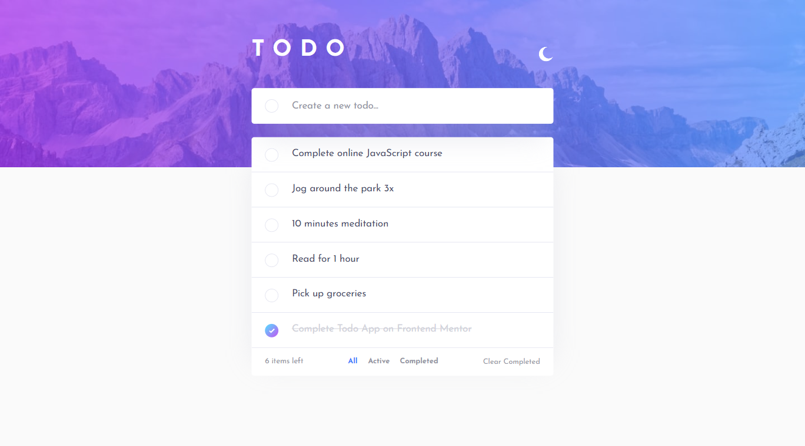

## Table of contents

- [Overview](#overview)
  - [The challenge](#the-challenge)
  - [Screenshot](#screenshot)
  - [Links](#links)
  - [Built with](#built-with)
  - [Author](#author)

## Overview

### The challenge

Users should be able to:

- See hover states for all interactive elements on the page
- Add new todos to the list
- Mark todos as complete
- Delete todos from the list
- Filter by all/active/complete todos
- Clear all completed todos
- Toggle light and dark mode

### Screenshot

### Links

- [Live](https://lonelybuddy.github.io/react-to-do/)
- [Solution](https://www.frontendmentor.io/solutions/html-csssass-jsreact-PDCwl2C5I)

### Built with

- HTML5
- CSS3
- JS
- React
- Sass

## Author

- Frontend Mentor - [@Henryzheng](https://www.frontendmentor.io/profile/LonelyBuddy)
